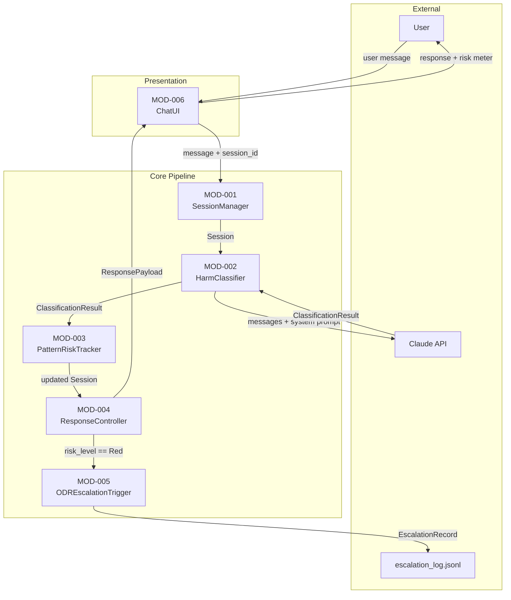
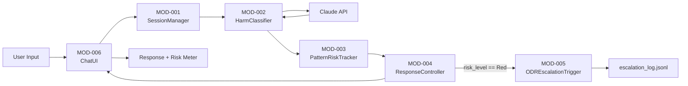

# Technical Design Document: MinorSafe AI Guardrail System

**Generated from:** project_charter.md, deliverables.md  
**Date:** 2026-06-13

---

## 1. System Architecture

### 1.1 Overview

MinorSafe is a sequential pipeline that intercepts each user message before a response is generated, classifies it against a set of harm categories, updates a cumulative session risk score, and selects a risk-appropriate response. The system's core differentiator is its session-level awareness: risk accumulates across turns, so a pattern of escalating boundary-probing triggers intervention even when no single message is unambiguous.

The architecture follows a linear pipeline pattern with a single branching point: when cumulative risk reaches Red, the ODR escalation module fires in parallel with response generation. All session state is held in memory for the duration of a conversation. The only persistence artifact is an append-only JSONL escalation log written when a Red event occurs.

The Claude API serves as both the harm classifier and the response generator. A structured system prompt — authored separately by the legal team — defines the classification rules, harm categories, risk thresholds, and safe redirect templates. The pipeline calls the API once per turn with the full conversation history, and the system prompt constrains the API to return a structured JSON payload containing classification metadata and a safe response.

### 1.2 Architecture Diagram

### 1.3 Design Decisions

| Decision | Rationale |
|----------|-----------|
| Single Claude API call per turn (classify + respond) | Reduces latency and avoids context drift between a classification call and a separate generation call. The system prompt constrains the model to return structured JSON that includes both the classification metadata and the safe response text. |
| In-memory session state | Sufficient for a hackathon demo; avoids database setup overhead. Session state is a Python dict keyed by session_id. |
| Append-only JSONL escalation log | Lightweight persistence for ODR records without a database. JSONL format is human-readable and trivially parseable. |
| Cumulative risk scoring with per-turn weighting | A single high-risk message should not automatically escalate to Red; patterns of repeated boundary-testing should. Weighting later turns more heavily in long sessions prevents early-session risk from diluting late escalation. |
| Streamlit for chat UI | Fastest path to a working demo with built-in widget support for a colored risk meter indicator. |
| System prompt as external artifact (DEL-002) | Harm category definitions and risk thresholds require legal expertise. Decoupling the prompt from the code means the legal team can iterate on definitions without touching the pipeline. |

---

## 2. Module Descriptions

### MOD-001: SessionManager

**Implements:** DEL-001  
**Purpose:** Creates and maintains in-memory session state, including age classification, turn history, and current risk level.

**Public Interface:**

| Function | Signature | Returns | Description |
|----------|-----------|---------|-------------|
| `create_session` | `(user_age_group: str) -> Session` | `Session` | Initializes a new session with a UUID, sets risk level to Green, cumulative score to 0.0 |
| `add_turn` | `(session: Session, turn: Turn) -> Session` | `Session` | Appends a completed turn to session history |
| `get_session` | `(session_id: str) -> optional[Session]` | `optional[Session]` | Retrieves session from in-memory store; returns None if not found |
| `update_risk` | `(session: Session, risk_level: str, cumulative_score: float) -> Session` | `Session` | Updates session risk level and cumulative score after each turn |
| `mark_escalated` | `(session: Session) -> Session` | `Session` | Sets `escalated` flag to True on the session |

**Dependencies:**
- **Internal:** None
- **External:** `uuid` (stdlib)

**Validated by:** VC-004

---

### MOD-002: HarmClassifier

**Implements:** DEL-001 (requires DEL-002 as system prompt input)  
**Purpose:** Sends each user turn to the Claude API with the system prompt and conversation history, and parses the structured classification response.

**Public Interface:**

| Function | Signature | Returns | Description |
|----------|-----------|---------|-------------|
| `classify` | `(session: Session, user_message: str) -> ClassificationResult` | `ClassificationResult` | Builds API payload, calls Claude, parses and returns structured result |
| `build_messages` | `(session: Session, user_message: str) -> list[map]` | `list[map]` | Constructs the messages array (conversation history + new turn) for the API call |
| `load_system_prompt` | `(path: str) -> str` | `str` | Reads the system prompt from file at the given path |
| `parse_response` | `(raw_response: str) -> ClassificationResult` | `ClassificationResult` | Extracts structured JSON from the API response text |

**Dependencies:**
- **Internal:** MOD-001 (Session)
- **External:** `anthropic` (Claude API client), `json` (stdlib)

**Validated by:** VC-001, VC-003

---

### MOD-003: PatternRiskTracker

**Implements:** DEL-001  
**Purpose:** Maintains the cumulative session risk score across turns and maps it to a risk level, applying turn-position weighting so later turns carry more influence.

**Public Interface:**

| Function | Signature | Returns | Description |
|----------|-----------|---------|-------------|
| `update` | `(session: Session, result: ClassificationResult) -> Session` | `Session` | Computes new cumulative score, determines risk level, updates session via MOD-001 |
| `compute_turn_score` | `(turn_index: int, turn_risk_score: float) -> float` | `float` | Applies position weight to a single turn's raw risk score |
| `compute_risk_level` | `(cumulative_score: float) -> str` | `str` | Maps score (0.0–1.0) to Green / Yellow / Orange / Red |

**Risk level thresholds:**

| Risk Level | Cumulative Score Range |
|------------|----------------------|
| Green | 0.0 – 0.29 |
| Yellow | 0.30 – 0.54 |
| Orange | 0.55 – 0.79 |
| Red | 0.80 – 1.0 |

**Dependencies:**
- **Internal:** MOD-001 (Session, update_risk)
- **External:** None

**Validated by:** VC-001, VC-004

---

### MOD-004: ResponseController

**Implements:** DEL-001  
**Purpose:** Selects and formats the appropriate user-facing response based on the current session risk level, including crisis resources at Red.

**Public Interface:**

| Function | Signature | Returns | Description |
|----------|-----------|---------|-------------|
| `generate_response` | `(session: Session, result: ClassificationResult) -> ResponsePayload` | `ResponsePayload` | Constructs the response payload for the current turn |
| `should_escalate` | `(session: Session) -> bool` | `bool` | Returns True if session risk_level is Red and not already escalated |

**Response behavior by risk level:**

| Risk Level | Response Type | Additional Content |
|------------|---------------|--------------------|
| Green | Use `result.safe_redirect` as response | None |
| Yellow | Use `result.safe_redirect` prefixed with a warning note | None |
| Orange | Use `result.safe_redirect` with restricted framing | Suggest trusted adult |
| Red | Refusal message | Crisis resources list |

**Dependencies:**
- **Internal:** MOD-001 (Session), MOD-003 (risk level)
- **External:** None

**Validated by:** VC-002, VC-003

---

### MOD-005: ODREscalationTrigger

**Implements:** DEL-001  
**Purpose:** Fires when a session reaches Red risk level; produces a timestamped escalation record and appends it to the JSONL log.

**Public Interface:**

| Function | Signature | Returns | Description |
|----------|-----------|---------|-------------|
| `trigger` | `(session: Session) -> EscalationRecord` | `EscalationRecord` | Builds an EscalationRecord from session state |
| `log_record` | `(record: EscalationRecord, log_path: str) -> None` | `None` | Serializes record to JSON and appends to the JSONL log file |

**Dependencies:**
- **Internal:** MOD-001 (Session)
- **External:** `json` (stdlib), `datetime` (stdlib)

**Validated by:** VC-002

---

### MOD-006: ChatUI

**Implements:** DEL-001  
**Purpose:** Renders the chat interface with a visible risk meter and routes user input through the pipeline.

**Public Interface:**

| Function | Signature | Returns | Description |
|----------|-----------|---------|-------------|
| `run` | `() -> None` | `None` | Starts the Streamlit app; initializes session state on first load |
| `render_risk_meter` | `(risk_level: str) -> None` | `None` | Renders a colored risk indicator (Green / Yellow / Orange / Red) |
| `render_message` | `(payload: ResponsePayload) -> None` | `None` | Displays the assistant response and any crisis resources |
| `handle_input` | `(user_message: str, session: Session) -> ResponsePayload` | `ResponsePayload` | Orchestrates the full pipeline for a single turn |

**Dependencies:**
- **Internal:** MOD-001, MOD-002, MOD-003, MOD-004, MOD-005
- **External:** `streamlit`

**Validated by:** VC-001, VC-002, VC-003, VC-004

---

## 3. Data Flow

### 3.1 Primary Data Flow

### 3.2 Flow Descriptions

| Flow ID | Source | Destination | Data Type | Trigger |
|---------|--------|-------------|-----------|---------|
| F-01 | User | MOD-006 | string (user message) | User submits message |
| F-02 | MOD-006 | MOD-001 | string (message), string (session_id) | Each new user turn |
| F-03 | MOD-001 | MOD-002 | Session | After turn is appended |
| F-04 | MOD-002 | Claude API | list[map] (messages), string (system prompt) | Per turn |
| F-05 | Claude API | MOD-002 | string (raw JSON response) | API response received |
| F-06 | MOD-002 | MOD-003 | ClassificationResult | After parse_response |
| F-07 | MOD-003 | MOD-004 | Session (updated risk) | After score update |
| F-08 | MOD-004 | MOD-005 | Session | When risk_level == Red and not escalated |
| F-09 | MOD-005 | escalation_log.jsonl | EscalationRecord (JSON) | On Red trigger |
| F-10 | MOD-004 | MOD-006 | ResponsePayload | After response generation |
| F-11 | MOD-006 | User | string (response), string (risk level) | Per turn |

---

## 4. Data Structures

### DS-001: Session

**Used by:** MOD-001, MOD-002, MOD-003, MOD-004, MOD-005, MOD-006  
**Purpose:** Represents the full state of a single user conversation.

| Field | Type | Constraints | Description |
|-------|------|-------------|-------------|
| `session_id` | string | required, unique | UUID v4 |
| `user_age_group` | string | required, one of: "minor", "unknown" | Age classification set at session start |
| `risk_level` | string | required, default: "Green" | Current risk level: Green / Yellow / Orange / Red |
| `cumulative_risk_score` | float | required, default: 0.0, range: 0.0–1.0 | Weighted aggregate of all turn scores |
| `turns` | list[Turn] | required, default: [] | Ordered list of completed turns |
| `created_at` | timestamp | required | Session creation time |
| `escalated` | boolean | required, default: false | True once ODR escalation has fired |

---

### DS-002: Turn

**Used by:** MOD-001, MOD-002, MOD-003  
**Purpose:** Represents a single user message and its classification result.

| Field | Type | Constraints | Description |
|-------|------|-------------|-------------|
| `turn_id` | integer | required, sequential from 0 | Position index within session |
| `user_message` | string | required | Raw user input |
| `classification` | ClassificationResult | required | Output of MOD-002 for this turn |
| `timestamp` | timestamp | required | Time the turn was processed |

---

### DS-003: ClassificationResult

**Used by:** MOD-002, MOD-003, MOD-004  
**Purpose:** Structured output from the Claude API for a single turn.

| Field | Type | Constraints | Description |
|-------|------|-------------|-------------|
| `harm_category` | string | required | One of the 10 harm categories, or "none" |
| `risk_level` | string | required, one of: Green, Yellow, Orange, Red | Per-turn risk level returned by the model |
| `turn_risk_score` | float | required, range: 0.0–1.0 | Numeric severity of this turn in isolation |
| `reasoning` | string | optional | Model's explanation for the classification |
| `safe_redirect` | string | required | The safe response text to deliver to the user |

---

### DS-004: ResponsePayload

**Used by:** MOD-004, MOD-006  
**Purpose:** The complete response package sent from the controller to the UI.

| Field | Type | Constraints | Description |
|-------|------|-------------|-------------|
| `risk_level` | string | required | Session risk level at time of response |
| `message` | string | required | The text to display to the user |
| `crisis_resources` | list[string] | optional, present when risk_level == Red | Crisis line links or contact info |
| `escalation_triggered` | boolean | required, default: false | True if this turn triggered ODR escalation |

---

### DS-005: EscalationRecord

**Used by:** MOD-005  
**Purpose:** The persistent ODR escalation artifact written to the log when Red is reached.

| Field | Type | Constraints | Description |
|-------|------|-------------|-------------|
| `record_id` | string | required, unique | UUID v4 |
| `session_id` | string | required | References DS-001.session_id |
| `timestamp` | timestamp | required | Time of escalation |
| `trigger_turn_id` | integer | required | Turn index that pushed score into Red |
| `final_risk_score` | float | required | Cumulative score at time of escalation |
| `turn_count` | integer | required | Total turns in session at escalation |
| `harm_categories_detected` | list[string] | required | All unique harm categories across session |

---

## 5. Traceability Matrix

| Deliverable | Description | Modules | Validation Conditions |
|-------------|-------------|---------|----------------------|
| DEL-001 | MinorSafe Pipeline Prototype | MOD-001, MOD-002, MOD-003, MOD-004, MOD-005, MOD-006 | VC-001, VC-002, VC-003, VC-004 |
| DEL-002 | System Prompt Specification | MOD-002 (consumer) | VC-001, VC-005 |
| DEL-003 | Pitch Deck | — (non-code artifact) | — |

---

## Appendix A: Glossary

| Term | Definition |
|------|------------|
| ODP | Online Dispute Prevention — proactive intervention before harm escalates to a dispute |
| ODR | Online Dispute Resolution — structured process (negotiation → mediation → arbitration) triggered at Red risk |
| Risk Level | Green / Yellow / Orange / Red — a four-state classification of conversation danger, mapped from a cumulative numeric score |
| Harm Category | One of ten legally-defined conversation risk types (e.g., criminal liability exposure, self-harm language) defined in the system prompt |
| Cumulative Risk Score | A weighted aggregate of per-turn risk scores across the full session, ranging from 0.0 to 1.0 |
| System Prompt | The Claude API instruction set that defines classification rules, harm categories, thresholds, and safe redirect templates — authored by the legal team, consumed by MOD-002 |
| Safe Redirect | A response that declines to engage with harmful content while offering a constructive alternative |
| Escalation Record | A timestamped JSONL log entry capturing session context at the point of Red escalation, serving as the ODR trigger artifact |

---

## Appendix B: Open Questions

- [ ] What format should the system prompt use to return structured JSON? (Strict JSON only, or JSON embedded in natural language?) MOD-002's `parse_response` needs to know.
- [ ] Should `user_age_group` be declared by the user at session start, or inferred from conversation context by the classifier?
- [ ] Are crisis resources static strings (hardcoded) or fetched from a config file?
- [ ] What is the per-turn weighting formula for `PatternRiskTracker.compute_turn_score`? (Linear, exponential, or recency-window?)
